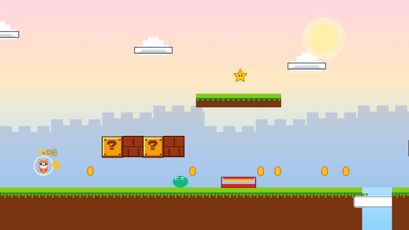

# 🎮 像素冒险物语 (OC Pixel Adventure)

> 一个纯静态 SPA 的横版像素闯关 + 文字对话游戏。自定义原创角色、上传立绘、跟 NPC AI 聊天，全在浏览器里跑。

## 🎯 在线试玩

**👉 [https://game.mimitu.top](https://game.mimitu.top)**

浏览器直接打开就能玩，无需下载。想让 NPC 对话更智能就在游戏内"API 接口"tab 填自己的 Gemini / DeepSeek / OpenAI 兼容 Key，不填也能玩（走内置离线台词模板）。



---


---

## ✨ 亮点

- **完全无后端**：整个游戏就是一个 `dist/` 静态目录，扔到任意 nginx / Caddy / OSS / CF Pages / Vercel 都能跑
- **AI 由玩家浏览器直连**：Gemini / DeepSeek / OpenAI 兼容三家通吃，站长不承担任何 AI 费用、看不到玩家对白和 Key
- **横版像素闯关**：4 个主题世界（草原/蘑菇/星夜/熔岩），二段跳、蹲滑、弹簧、金币、星星、Boss NPC
- **OC 工坊**：自建原创角色、上传头像 & 全身立绘（支持 Ctrl+V 剪贴板粘贴、拖拽上传）
- **NPC 定制**：给每个世界的 NPC 换名字、性格、初始台词、立绘
- **文游 AVG 对话**：右侧立绘展示、好感度羁绊系统、剧情分支选项 + 自由打字 + 情绪前缀
- **画面亮化**：奶油米 + 桃粉 + 天空蓝，告别原来的深紫黑
- **隐私中心**：明确告知图片和 Key 只存本机 localStorage，提供一键抹除

## 🤖 支持的 AI 服务商

主菜单 → **API 接口**，玩家自己填：

| 服务商 | baseUrl | 常用模型 | 国内可用性 |
| --- | --- | --- | --- |
| ✨ Google Gemini | 无需填 | `gemini-2.0-flash` | 需代理 |
| 🐬 DeepSeek | `https://api.deepseek.com` | `deepseek-chat` (V3) / `deepseek-reasoner` (R1) | ✅ 直连 |
| 🔌 OpenAI 兼容 | 自填（OpenRouter / OneAPI / 硅基流动 / 自建） | 自填 | 看端点 |

不填 Key 也能玩，NPC 会用内置的离线台词模板。

## 🚀 本地跑

前提：Node.js v18+。

```bash
git clone https://github.com/baimimitu-stack/oc-pixel-adventure.git
cd oc-pixel-adventure
npm install
npm run dev
# 浏览器打开 http://localhost:3000
```

Windows 用户可直接双击 `RUN.bat`（内部指向便携版 Node）。

## 📦 打包上线

```bash
npm run build
# 产物在 dist/
```

或双击 `BUILD.bat`。把整个 `dist/` 目录传到任意静态服务器即可。

## 🌐 部署到自己的域名

详细步骤见 [`deploy/DEPLOY.md`](deploy/DEPLOY.md)，nginx 配置模板见 [`deploy/nginx-site.conf`](deploy/nginx-site.conf)。

本站 `game.mimitu.top` 用的是 **Caddy + 反代**，因为服务器上已有其他 Caddy 服务，Caddyfile 追加一段就行：

```caddy
game.mimitu.top {
    encode gzip zstd
    root * /var/www/oc-pixel-adventure
    try_files {path} /index.html
    file_server
    @assets path /assets/*
    header @assets Cache-Control "public, max-age=2592000, immutable"
}
```

Caddy 会自动申请免费 Let's Encrypt SSL 证书。

## 📁 项目结构

```
src/
├── App.tsx                    主应用壳
├── main.tsx                   React 入口
├── index.css                  Tailwind + 主题变量
├── types.ts                   类型定义
├── game/
│   ├── GameCanvas.tsx         Canvas 物理引擎 & 渲染
│   └── levels.ts              4 关关卡数据
├── components/
│   ├── MainMenuModal.tsx      主菜单 (含 API/存档/隐私 tab)
│   ├── OCStudio.tsx           OC 工坊 (自建角色 + 上传立绘)
│   ├── AppearanceShop.tsx     金币外观商店
│   ├── NPCCustomizerModal.tsx NPC 定制 + 立绘上传
│   ├── StoryDialogueModal.tsx AVG 对话舞台
│   ├── AchievementModal.tsx   成就殿堂
│   └── WorldSelectModal.tsx   大地图
└── services/
    ├── db.ts                  localStorage 持久化
    ├── sound.ts               Web Audio 8-bit 音效
    ├── aiClient.ts            浏览器直调 AI (Gemini/DeepSeek/OpenAI 兼容)
    └── proceduralEngine.ts    离线台词模板兜底
deploy/
├── DEPLOY.md                  部署到 VPS 的完整步骤
└── nginx-site.conf            nginx 配置模板
```

## 🔒 隐私

- 所有玩家上传的图片（OC 头像/立绘、NPC 立绘）都作为 base64 存进浏览器 localStorage，**从不上传**
- AI 请求由玩家浏览器**直接发到 AI 厂商**，中间没有站长的服务器
- AI 请求体只含文字（角色名、性格、玩家输入），**从不含图片**
- 玩家 API Key 只在本机 localStorage
- 主菜单 → 隐私中心提供一键抹除

## 📄 License

MIT
